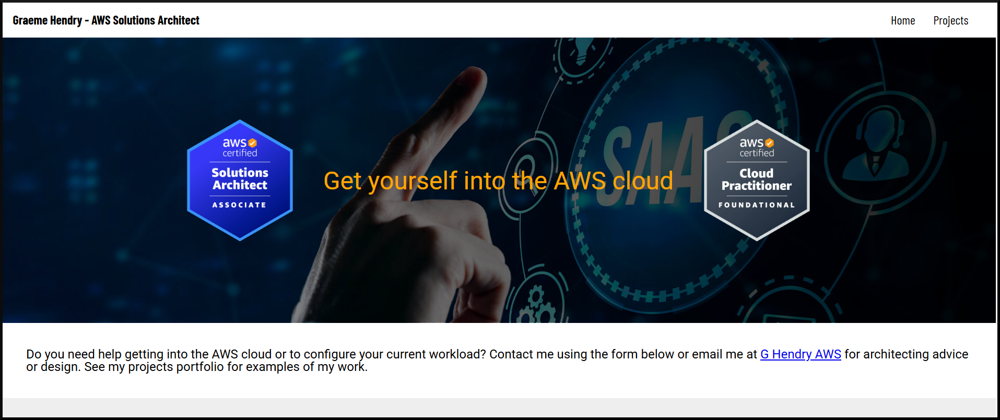
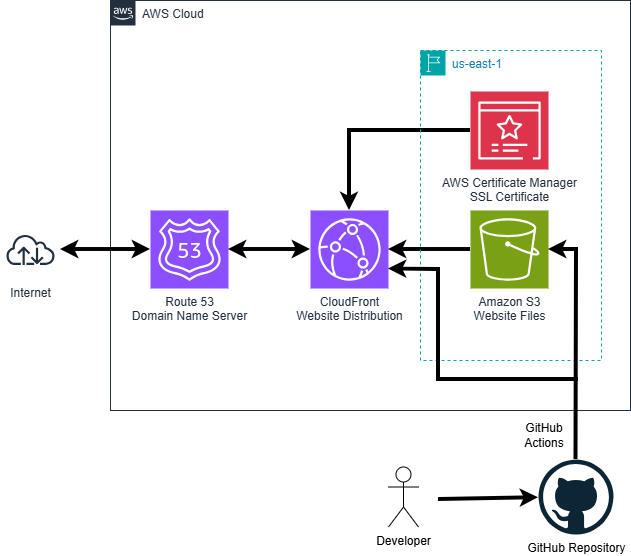
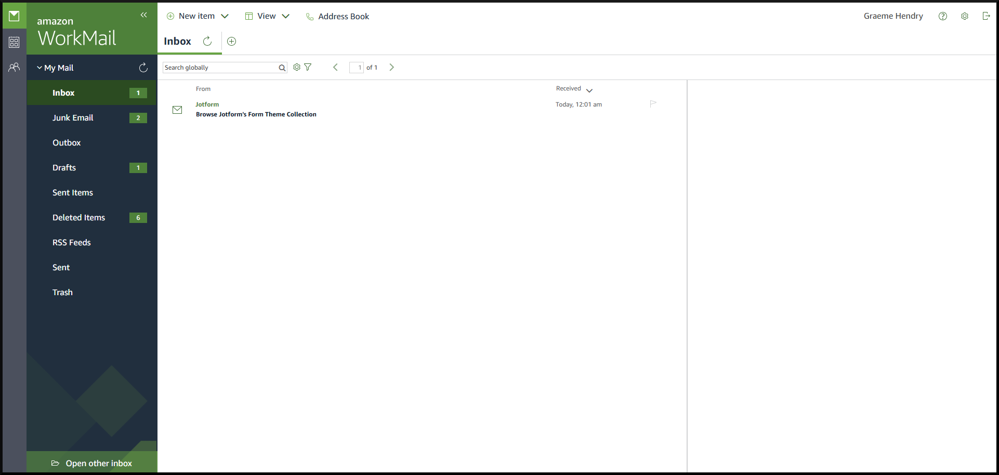
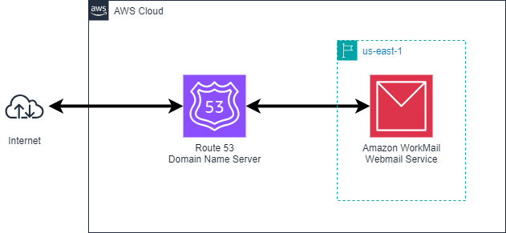
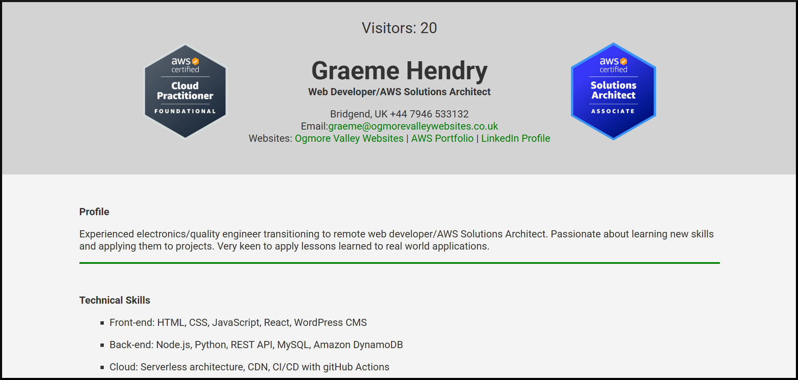
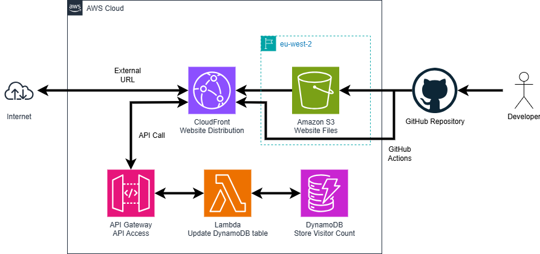

# AWS Projects

The projects for my AWS portfolio and the portfolio website
Use GitHub Actions to upload to Amazon S3 Bucket

https://www.ghendryaws.co.uk/

## Projects

- Static Website
- WorkMail Email Server
- Cloud Resume Challenge Part 1

## Static Website

https://www.ghendryaws.co.uk/pages/static-website.html

### Description

This website is hosted as a static website in an Amazon S3 bucket and published via an Amazon CloudFront distribution. The domain name is managed by Amazon Route 53 with SSL certificate issued by AWS Certificate Manager. Deployment of the website code to Amazon S3 and distribution via Amazon CloudFront is automated from a GitHub repository using GitHub Actions.

### Architecture

## WorkMail

https://www.ghendryaws.co.uk/pages/workmail-email-server.html

### Description

This project demonstrates the deployment and configuration of an email server using Amazon WorkMail. The email server is integrated with a custom domain managed by Amazon Route 53, and users can access their email via the Amazon WorkMail web application or through compatible email clients.

### Architecture

## Cloud Resume Challenge Part 1

https://www.ghendryaws.co.uk/pages/cloud-resume-challenge-part-1.html

### Description

The Cloud Resume Challenge is a guided project to generate a resume webpage hosted in the cloud using cloud resources and development best practices. It comes in 3 flavours - AWS, Azure, and Google. Part 1 is to build a static webpage and then add a back-end to store a count of visitors that can be displayed on the page.

### Architecture

